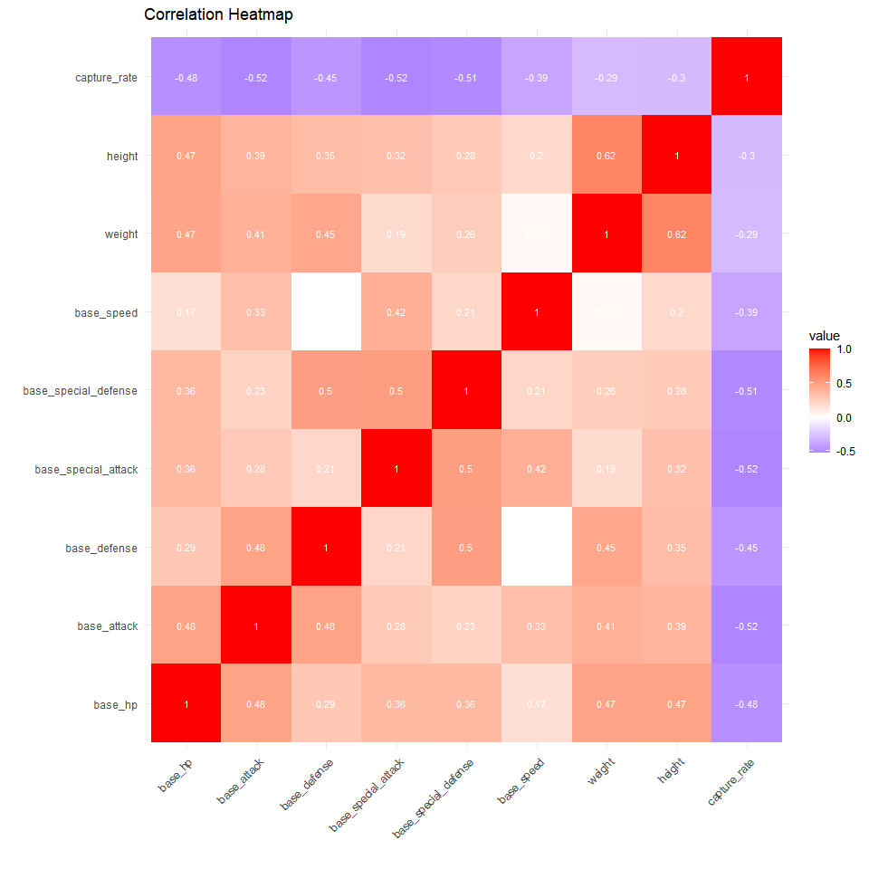

Analyzing JSON Data with R
================

## Using the R to Analyze Data from the Pokémon API

I recently created a vignette demonstrating how R can be used to query data from the [Pokémon API](https://pokeapi.co/), and then used in a simple analysis. The vignette can be found here: [Vignette - Pokémon Species Analysis](https://benton-tripp.github.io/poke-vignette/), and the GitHub repository can be found here: [benton-tripp /
poke-vignette](https://github.com/benton-tripp/poke-vignette). The vignette presents a comprehensive analysis of Pokémon species data, demonstrating the power of R in handling and analyzing complex data structures. 

## Vignette - Pokémon Species Analysis (Summary)

The vignette is divided into several sections, each focusing on a different aspect of the data and the analytical techniques used: 

### Data Acquisition and Preparation

The first step in the analysis involves acquiring the data from the Pokémon API. The `httr` and `jsonlite` packages in R are used to send HTTP requests to the API and parse the returned JSON data, respectively. The data is then transformed into a more manageable format for analysis, a process known as data wrangling. This includes tasks such as removing unnecessary variables, handling missing values, and converting data types.

### Exploratory Data Analysis

Once the data is prepared, exploratory data analysis (EDA) is conducted to understand the characteristics and patterns within the data. This involves generating summary statistics and visualizations. The `ggplot2` package is used to create plots for visual exploration. However, the focus here is not on the aesthetics of the plots but on the insights they provide.

### Principal Component Analysis and Clustering

The vignette delves deeper into the data by performing a Principal Component Analysis (PCA) and clustering. PCA is a dimensionality reduction technique that transforms the data into a new coordinate system such that the greatest variance lies on the first coordinate (the first principal component), the second greatest variance on the second coordinate, and so on. This allows for the visualization and understanding of high-dimensional data.

Clustering, on the other hand, is a technique used to group similar data points together. In this vignette, the `factoextra` package is used to perform K-means clustering on the PCA results. The goal is to identify groups of Pokémon species that share similar characteristics.

### Results

Probably the most interesting results from this analysis are the interactive plots generated at the conclusion of the analysis, found at the following locations:

- [Interactive 2-Dimensional Scatter Plot of PCA/Clustering Results]([Vignette - Pokémon Species Analysis](https://benton-tripp.github.io/poke-vignette/plots/plot_2d.html))
- [Interactive 3-Dimensional Scatter Plot of PCA/Clustering Results]([Vignette - Pokémon Species Analysis](https://benton-tripp.github.io/poke-vignette/plots/plot_2d.html))

Perhaps the most informative result provided during EDA is the heatmap generated from the correlation of the different numeric variables:

<!-- -->

## Conclusion

### Challenges

### What would I do Differently

### Final Thoughts

The vignette demonstrates the potential of R in handling and analyzing complex data structures, and the power of data analysis in extracting meaningful insights from raw data. The Pokémon API serves as a fun and interesting data source for this demonstration, but the techniques and methods used can be applied to any data analysis task.

